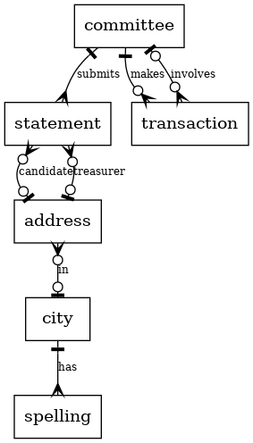

# Oregon Campaign Finance Database Design

By Noah Birnel

Video overview: FIXME

Full source on
[GitHub](https://github.com/nbirnel/oregon-campaign-finance-database).

## Scope

This database contains publicly available information from the Oregon
Secretary of State's Campaign Finance page
[OreStar](https://secure.sos.state.or.us/orestar/).

* Committees: the organizations identified as running a political campaign.
  - name
  - type (PAC, CC, or CPC)
  - subtype (Political Party, Recall, etc)
* Statements of Organization: individual campaigns run by a committee in an election for a measure or a candidate.
  - the candidate and what office they are running for, or the measure
  - the election
  - contact information for the treasurer and candidate
* Transactions: Individual exchanges of money or goods by committees.
  - the amount
  - information about who paid or received money
  - information about review and accounting

Out of scope are outcomes of elections.

Since our dataset is publicly available by small-ish XLS files rather
than an API or a comprehensive zip, the scope is also limited
by the manual time required. 
This particular iteration will include all Committees and Statements
back to the earliest data offered on OreStar,
but will only include Transactions for elections in the City of Eugene --
an area of particular interest for the author.

## Functional Requirements

This database will support:

* CRUD operations on Committees, Statements, and Transactions.
* Allow Transactions and Statements to be easily updated from the OreStar
  website as new elections occur

## Representation

### General Notes

All date fields provided by OreStar are in `YYYY/MM/DD` format.
This database retains the original field, 
but also provides virtual generated columns in ISO8601 format, for easy ordering.

### Entities

#### Committees

The `committees` table consists of:

* `id`: the unique ID of the Committee pulled from OreStar's data as an `INTEGER`.
   This has a `PRIMARY KEY` constraint.
* `name`:the name of the Committee, pulled from OreStar's data as `TEXT`.
* `type`:the "type" of the committee, as `TEXT`.
   All data from OreStart has been either PAC, CC, or CPC,
   but we don`t control what might come from OreStar so there are no restrictions on this.
* `subtype`:further "type" information about the committee.
   Most committees have a `NULL` value for this column, 
   but values such as "Caucus", "Measure", "Recall", or "Inititative Petition No. 70 - 2010" are observed.

#### Statements

The `statements` table consists of 27 columns,
viewable with `.schema "statements"`.
Of main interest are:

* `id`: a unique ID for the statement as an `INTEGER`, with the `PRIMARY KEY` constraint.
* `committee_id`: the ID of the committee who made the statement, as an `INTEGER`. 
   This is `FOREIGN KEY` constrained on `committees.id`.
* `candidate_office`: the district / ward / other geographic scope of the statement as `TEXT`.
   For instance, "City of Eugene, Ward 6". 
* `candidate_office_group`: the position being run for, such as "City Councilor" as `TEXT`.
* `filing_date_iso8601`: the date the statement was filed, as ISO8601 `TEXT`.
* `treasurer_first_name`: the treasurer's first name as `TEXT`.
* `treasurer_last_name`: the treasurer's last name as `TEXT`.
* `treasurer`: (generated) the treasurer's first and last name as `TEXT`.
* `treasurer_address_id`: the ID of the treasurer's address as an `INTEGER`.
   This is `FOREIGN KEY` constrained on `addresses.id`, and is created by a post-insert trigger.
* `candidate_first_name`: the candidate's first name as `TEXT`.
* `candidate_last_name`: `the candidate's last name as TEXT`.
* `candidate`: (generated) the candidate's first and last name as `TEXT`.
* `candidate_address_id`: the ID of the candidate's address as an `INTEGER`.
   This is `FOREIGN KEY` constrained on `addresses.id`, and is created by a post-insert trigger.
* `active_election`: the election the statement is valid for as `TEXT`,
   such as "2015 May Election".
* `measure`: the measure supported or opposed by the Committe, as `TEXT`.
*  `candidate_or_measure` (generated) the candidate or the measure as TEXT.

Other fields come in from OreStar, and are retained for completeness.

#### Transactions

The `transactions` table consists of 52 columns,
viewable with `.schema "transactions"`.

These are the columns most likely to be useful:

* `id`: the unique ID of the transaction pulled from OreStar's data as an `INTEGER`.
   This has a the `PRIMARY KEY` constraint.
* `original_id`: the ID of the orignal transaction as an `INTEGER`.
   This will be different than `id` if the transaction was amended.
* `transaction_date_iso8601`: the date the transaction was made, as ISO8601 `TEXT`.
* `transaction_status`: whether the transaction is "Original" or "Amended", as `TEXT`.
* `contributor_or_payee`: who was on the other end of the transaction than the committee, as `TEXT`.
* `sub_type`: the "Sub Type", for instance "Pledge of Cash" of the transaction, as `TEXT`.
* `amount`: the amount of the transaction, as `TEXT`.
* `contributor_or_payee_committee_id`: the ID of the contributor or payee (if they are a commitee) as `INTEGER`.
   This has a `FOREIGN KEY` constraint on `committees.id`.
* `filer_id`: the id of the filer, as `INTEGER`.
   This has a `FOREIGN KEY` constraint on `committees.id`.
* `employer_name`: the employer of a contributor or payee as `TEXT`.
* `city`: the city of a contributor or payee as `TEXT`.
* `state`: the state of a contributor or payee as `TEXT`.
* `country`: the country of a contributor or payee as `TEXT`.

Other fields come in from OreStar, and are retained for completeness.

#### Addresses

The `addresses` table consists of 11 columns,
viewable with `.schema "addresses"`.
Six of the columns are an unfortunate artifact of the implementation,
and will not be described here.

The five useful columns are:

* `id`: the ID of the address as an `INTEGER`.
   This has the `PRIMARY KEY` constraint.
* `address`: the address as represented by OreStar, as `TEXT`.
   This has a `UNIQUE` constraint, since we do not wish to store the same address twice.
* `city_id`: the ID of the address's city, as an `INTEGER`.
   This is has a `FOREIGN KEY` constraint on `oregon_cities.id`.
* `state`: the state as `TEXT`.
* `zip`: the 5 digit zip code as `TEXT`.
   (While a zip "looks like" a number, it is better thought of as an string.
   You cannot do meaningful math with zip codes, for instance.)

Note that the `address` column is a single-line format as a human might write,
and it is clear that there is little or no validation on OreStar's end.

#### Oregon Cities

The `oregon_cities` table contains:

* `id`: the unique ID of an Oregon city or community as an `INTEGER`.
   This has the `PRIMARY KEY` constraint.
* `city`: the name of the city as `TEXT`.
   This has a `UNIQUE` constraint.

Cities are drawn from 
https://en.wikipedia.org/wiki/List_of_cities_and_unincorporated_communities_in_Oregon,
with the addition of "Westlake", a value found in the dataset.

A trigger on `INSERT`s generates a lower_case spelling in
`oregon_city_spellings.spelling`.

This table, and `oregon_city_spellings`, are primarily intended
for normalizing city spelling and capitalization at import time.

#### Oregon City Spellings

The freeform address fields of the OreStar dataset can contain
many creative capitalizations and spellings.
To normalize these, `oregon_city_spellings` contains:

* `id`: the unique ID of a spelling as `INTEGER`.
   This has the `PRIMARY KEY` constraint.
* `city`: the ID of the city as `INTEGER`.
   This has a `FOREIGN KEY` constraint on `cities.id`.
* `spelling`:  a `UNIQUE` spelling of a city as `TEXT`.

Lookups on `spelling` should be `lower()`ed.

### Views

#### Committee Statements

A join of `committees` and `statements`.
`statements` columns keep their names, 
while `committees` are renamed:

* `name` -> `committee`
* `type` -> `committee_type`
* `subtype` -> `committee_subtype`

#### Committee Transactions

A join of `committees` and `transactions`.
`transactions` columns keep their names, 
while `committees` are renamed:

* `name` -> `committee`
* `type` -> `committee_type`
* `subtype` -> `committee_subtype`

### Contributions

A select of `committee_transactions`,
with only Contribution sub-types included.

`contributor` is also generated from `contributor_or_payee`.

### Relationships

Relationships in the database are represented in this ER Diagram:



As seen in the diagram:

* A committee can submit many statements.
  It does not exist until it has submitted a statement. 
  A statement is make by one and only one committee.
* A committee can make zero or more transactions.
  Some committees have not yet (or never) make any transactions.
  Each transaction is made by one and only one committee.
* A transaction can involve zero or one other committees.
  (For example, a committee can donate its funds to another committee 
  when a candidate bows out.)
  A committee can have been "involved" in zero or more transactions.
* A statement can have zero or one candidate addresses.
  An address can be associated with zero or more candidates:
  Zero, if it has never been the address of a candidate.
  One or more if it has been the address of one or more candidates.
* A statement can have zero or one treasurer addresses.
  An address can be associated with zero or more treasurers:
  Zero, if it has never been the address of a treasurer.
  One or more if it has been the address of one or more treasurers.
* An address is currently generated in our system by import of a statement,
  and so will always be the address of a candidate or treasurer from a statement,
  but there is no schema restriction on an unassociated address.
* An address can be in zero or one cities:
  Zero, if the city is not parsable by us from the address, or is not in our list of cities.
  One, otherwise.
  A city has zero or more addresses.
* A city has one or more spellings.
  It has at least our standardize lower case spelling, 
  and possibly other abbreviations, punctuations, or misspellings observed
  in real-world data (all cast to lower case).

## Optimizations
    
The data set is small enough that most read queries do not demonstrate
any annoying slowness. 

However, multi-column restraints, and triggers with cross-table lookups 
made for some pretty slow load times before these optimizations were made:

### Statements

It is expected that we will be loading data in the future as elections happen.
Therefore, we need `UNIQUE` constraint on `statements` for these fields:

* `committee_id`
* `active_election`
* `candidate_or_measure`

However, as the table gets over a thousand records, 
load times increase significantly.
Therefore the constraint is implemented as a `UNIQUE INDEX`. 
This brings load times down by 70 - 80 %.

A final oddity of this implementation derives from SQLite's implementation
of `NULL` uniqueness: every `NULL` is unique.
To make our empty values non-unique,
there is a `NOT NULL` constraint on 
`active_election` and `candidate_or_measure`
that converts `NULL`s to the empty string.

### Oregon City Spellings

Also on import, strange spellings will need to be looked up.
An index on `oregon_city_spellings(spelling)` has a measurable impact on load speed.

## Limitations

### Filers
Filers are not normalized.
The OreStar interface only allows pulling down one at a time, so it is not 
a reasonable way to retrieve the data.

### Addresses
Addresses are implemented in a very clunky way.

### People
It would be nice to have normal tables for
* `people`
* `candidates`
* `treasurers`
* `donors`
* `payees`

Sadly, we do not have a way of ensuring the that two different
'John Smith's from this dataset can be distinguished.

### Sorting Names

Sample queries have enough 

```
ORDER BY lower(treasurer_last_name), lower(treasurer_first_name)
```

that it might be a good idea to have generated columns for `colatable_name`.

### Money

There is no perfect solution for storing money amounts in SQLite.
We are using `TEXT`.
`sum()` will cast this to float, 
but `ORDER BY` will not, so we must `cast()` in our queries.

## Fetching and Loading Additional Data

These instructions assume a Unix-like shell
(Linux, MacOS, WSL on Windows, etc)
with LibreOffice installed.

### New Statements by year or election

* Navigate to https://secure.sos.state.or.us/orestar/GotoSearchByElection.
* Enter the year, and optionally the Election.
* Check "Discontinued Committees" near the bottom.
* Hit "Submit"
* On the new page with "Committe/Filer Search Results", 
  click "Export To Excel Format" near the upper right.
* Move the downloaded `XcelSooSearch.xls` to a reasonable storage place,
  renaming to a more reasonable title
  - for instance, `2026-downloaded-2026-03-01.xls`.
* Convert to CSV. 
  Using LibreOffice, this looks like
  ``loffice --headless --convert-to csv 2026-downloaded-2026-03-01.xls``
* Generate an import SQL file with
  `./generate-statements-import.sh 2026-downloaded-2026-03-01.csv`
* Run the import: `cat import-statements-2026-downloaded-2026-03-01.sql`

### New transactions

These are more tedious than Statements,
since they can only be fetched from OreStar by Filer or Committe.

* Navigate to https://secure.sos.state.or.us/orestar/gotoPublicTransactionSearch.
* Enter the Filer or Committee ID or Name, **or** a Contributor/Payee name,
  and optionally a date range.
* Hit "Search".
* On the new page with "Transaction Search Results", 
  click "Export To Excel Format" near the upper middle.
* Move the downloaded `XcelSooSearch.xls` to a reasonable storage place,
  renaming to a more reasonable title
  - for instance, `2026-downloaded-2026-03-01.xls`.
* Move the downloaded `XcelCNESearch.xls` to a reasonable storage place,
  renaming to a more reasonable title
  - for instance, `4788-downloaded-2024-03-13.xls`.
* Convert to CSV. 
  Using LibreOffice, this looks like
  ``loffice --headless --convert-to csv 4788-downloaded-2026-03-13.xls``
* Generate an import SQL file with
  `./generate-transactions-import.sh 4788-downloaded-2026-03-13.csv`
* Run the import: `cat import-transactions-4788-downloaded-2026-03-13.sql | sqlite3 ocf.db`

### Semi-automated fetching of data

The script `fetch-orestar` can speed up fetching data from OreStar.
It assumes you have `xclip` and LibreOffice installed.

Let us say we want to update transactions or Eugene Ward 1 elections
filed in 2024 or later.

Create a file with values you would paste into OreStar, one per line.

For instance: 
```
echo "select committee_id from statements where candidate_office = 'City of Eugene, Ward 1' and filing_date_iso8601 >2023;"\
| sqlite3 ocf.db >committee_ids.txt
```

Note the name and location of the Downloaded file:
  - `~/Downloads/XcelSooSearch.xls`, for instance.

Create a destination directory to place your files in.

Run 
```
./fetch-orestar committee_ids.txt ~/Downloads/XcelSooSearch.xls transactions
```

`fetch-orestar` will print the values on your terminal,
and place them in your clipboard, one at a time. 
Paste into the "Committee/Filer ID" text box, hit "Search",
and hit "Export to Excel Format".

When the export is complete, hit `ENTER` in your terminal. 
`fetch-orestar` will move the downloaded file to `transactions/23252.xls`,
and print the next line of your file.

If there is nothing to export as Excel (that is, there were no records found),
just hit `ENTER` anyway. The script will create an empty file.

I have found one can fetch records fast enough this way that the OreStar
page rate limits me. 

`fetch-orestar` consumes the file as it goes, so if you are interrupted
at any point, you do not have to start from the beginning.

Once complete, `fetch-orestar` will convert all of the `.xls` to `.csv`,
and remove the now unneeded `.xls` files.
